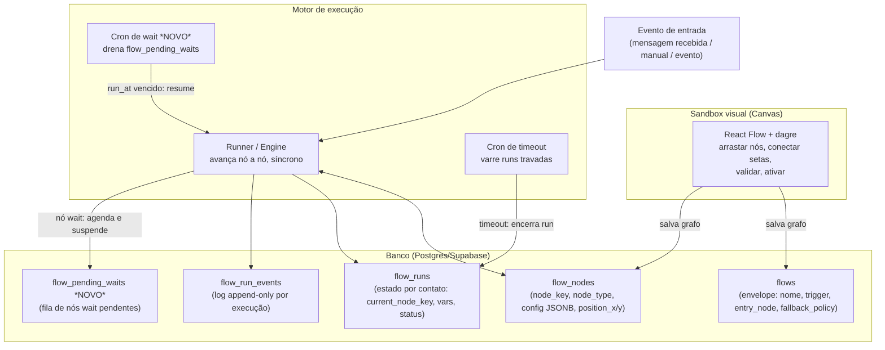

# Módulo Follow-up — Visão Geral

> Documentação extraída da análise do código-fonte do **wacrm** (WhatsApp CRM), com o objetivo de replicar
> apenas o **sandbox visual de criação de fluxos** — e estendê-lo para suportar follow-up real por tempo —
> em outro app (ImobFlow, Next.js + Supabase).

## 1. O problema: dois sistemas, nenhum completo

Ao investigar o wacrm em busca de "sandbox de criar flows de follow-up", encontramos **dois módulos
distintos e complementares**, nenhum dos dois sozinho cobrindo o que foi pedido:

| | `flows` | `automations` |
|---|---|---|
| Editor visual (canvas drag-and-drop) | ✅ Sim — React Flow + dagre | ❌ Não — lista/árvore de steps |
| Nó de espera / delay (`wait 1 dia`) | ❌ Não existe | ✅ Sim (`wait` step) |
| Dispara por mensagem recebida (chatbot) | ✅ Sim (`keyword`, `first_inbound_message`) | ✅ Sim |
| Fila de execução futura + cron | ❌ Não precisa (é síncrono) | ✅ `automation_pending_executions` + cron |
| Auditoria por execução | ✅ `flow_run_events` | ✅ `automation_logs` |
| Template pronto de "follow-up" | ❌ | ✅ `follow_up_reminder` (wait 1 dia → send_message) |

Ou seja: o canvas bonito que dá pra arrastar nós e conectar setas (`flows`) **não sabe esperar**. E o
motor que sabe esperar e mandar um nudge depois de X tempo (`automations`) **não tem canvas** — é uma
lista linear/árvore editada por formulário.

## 2. A decisão de design deste pacote de documentos

Esta documentação **funde os dois sistemas em um só design**: usa a arquitetura de canvas de `flows`
como base (é isso que o usuário quer replicar visualmente) e **acrescenta um novo tipo de nó, `wait`**,
cujo mecanismo de suspensão é emprestado do padrão fila-mais-cron de `automations`.

Ao longo dos documentos seguintes, tudo que é descrito como existente no wacrm traz o caminho do arquivo
fonte (`path:linha`). Tudo que é **proposta de extensão** (o nó `wait`, a tabela `flow_pending_waits`, o
endpoint de cron correspondente) é sinalizado explicitamente como tal — não existe hoje no wacrm, é o
desenho recomendado para o ImobFlow alcançar o objetivo de "sandbox visual de follow-up".

## 3. Arquitetura resultante

## 4. O que cada peça representa nesta doc

- **Modelo de dados** (`01-modelo-de-dados.md`, `01-schema.sql`) — as 4 tabelas do wacrm + a tabela nova
  `flow_pending_waits`.
- **Tipos e lógica do motor** (`02-tipos-e-logica-do-motor.md`) — os tipos de nó (union discriminada) e o
  algoritmo de avanço/suspensão/retomada, incluindo o novo nó `wait`.
- **Sandbox visual / canvas** (`03-sandbox-visual-canvas.md`) — o documento central: como o canvas
  React Flow renderiza os nós, deriva as setas, valida e mantém estado. É a parte que o usuário quer
  replicar quase 1:1.
- **Telas e navegação** (`04-telas-e-navegacao.md`) — inventário de páginas e fluxo de uso.
- **API** (`05-api-endpoints.md`) — contrato REST do backend do módulo.
- **Plano de implementação** (`06-plano-de-implementacao.md`) — roadmap fatiado para construir isso no
  ImobFlow, na ordem certa.

## 5. Por que a decisão "edges dentro do config" importa tanto

Uma decisão de arquitetura do wacrm atravessa todos os documentos e vale destacar aqui, cedo: **as arestas
do grafo (edges) não são uma tabela separada**. Cada nó guarda, dentro do seu `config` (JSONB), a chave do
próximo nó (`next_node_key`, ou `true_next`/`false_next` no caso do `condition`, ou um `next_node_key` por
botão/linha nos nós de múltipla saída). O canvas **deriva** as setas visuais a partir dessas referências em
tempo de renderização; arrastar uma conexão no canvas escreve de volta dentro do `config` do nó de origem.

Isso significa:
- O motor de execução nunca precisa de um JOIN para saber "para onde vou depois deste nó" — é um campo no
  próprio registro que ele já carregou.
- Clonar/templatizar um flow não exige reescrever UUIDs de referência, porque `node_key` é uma string
  estável escolhida pelo autor (ex. `"menu_principal"`), não o UUID da linha.
- O preço pago é que "deletar um nó" precisa varrer todos os outros nós e limpar qualquer referência a ele
  (senão sobra seta pendurada) — é isso que a função `unlinkNodeReferences` faz no wacrm.

Essa decisão é revisitada em detalhe em `02-tipos-e-logica-do-motor.md` e `03-sandbox-visual-canvas.md`.
