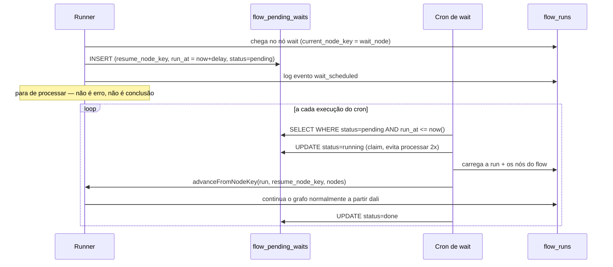

# Tipos e Lógica do Motor (Engine)

Fontes principais: `src/lib/flows/types.ts`, `src/lib/flows/engine.ts`, `src/lib/flows/edges.ts`,
`src/lib/flows/validate.ts` (wacrm). O nó `wait` e tudo que o envolve é proposta de extensão.

## 1. Tipos de nó — união discriminada

Cada nó tem um `node_type` e um `config` cuja forma depende do tipo. TypeScript modela isso como union
discriminada, o que permite ao compilador flagar `switch`s incompletos quando um novo tipo é adicionado
(`assertNever`).

```ts
export type FlowNodeConfig =
  | { node_type: "start"; config: StartNodeConfig }
  | { node_type: "send_message"; config: SendMessageNodeConfig }
  | { node_type: "send_buttons"; config: SendButtonsNodeConfig }
  | { node_type: "send_list"; config: SendListNodeConfig }
  | { node_type: "send_media"; config: SendMediaNodeConfig }
  | { node_type: "collect_input"; config: CollectInputNodeConfig }
  | { node_type: "condition"; config: ConditionNodeConfig }
  | { node_type: "set_tag"; config: SetTagNodeConfig }
  | { node_type: "wait"; config: WaitNodeConfig }        // NOVO — proposta
  | { node_type: "handoff"; config: HandoffNodeConfig }
  | { node_type: "end"; config: EndNodeConfig };
```

### Configs existentes no wacrm

```ts
interface StartNodeConfig { next_node_key: string }

interface SendMessageNodeConfig {
  text: string;              // suporta interpolação {{vars.X}}
  next_node_key: string;
}

interface SendButtonsNodeConfig {
  text: string;
  header_text?: string;
  footer_text?: string;
  buttons: Array<{ reply_id: string; title: string; next_node_key: string }>; // 1-3
}

interface SendListNodeConfig {
  text: string;
  button_label: string;
  header_text?: string;
  footer_text?: string;
  sections: Array<{
    title?: string;
    rows: Array<{ reply_id: string; title: string; description?: string; next_node_key: string }>;
  }>; // até 10 linhas no total
}

interface SendMediaNodeConfig {
  media_type: "image" | "video" | "document";
  media_url: string;
  caption?: string;
  filename?: string;
  next_node_key: string;
}

interface CollectInputNodeConfig {
  prompt_text: string;
  var_key: string;           // onde salvar a resposta em flow_runs.vars
  validation?: "any" | "email" | "phone" | "regex";
  regex?: string;
  next_node_key: string;
}

type ConditionOperator = "equals" | "contains" | "present" | "absent";
type ConditionSubject = "var" | "tag" | "contact_field";

interface ConditionNodeConfig {
  subject: ConditionSubject;
  subject_key: string;       // nome da var, UUID da tag, ou campo do contato
  operator: ConditionOperator;
  value?: string;
  true_next: string;
  false_next: string;
}

interface SetTagNodeConfig {
  mode: "add" | "remove";
  tag_id: string;
  next_node_key: string;
}

interface HandoffNodeConfig {
  note?: string;
  assign_to?: string;        // user_id do agente
}

type EndNodeConfig = Record<string, never>; // terminal, sem config
```

### Config nova proposta: `wait`

```ts
/**
 * NOVO node_type — não existe no wacrm. Espelha WaitStepConfig do
 * motor de automations (src/types/index.ts:537-540 no wacrm), que já
 * resolve exatamente este problema, só que sem canvas.
 */
interface WaitNodeConfig {
  amount: number;
  unit: "minutes" | "hours" | "days";
  /** Nó a retomar quando o tempo passar. */
  next_node_key: string;
}
```

## 2. Classificação dos nós pelo comportamento do runner

O runner classifica cada tipo de nó em uma de três categorias — isso decide se ele continua andando pelo
grafo sozinho ou para e espera algo:

```ts
/** Avança sozinho para o próximo nó, sem esperar nada. */
function isAutoAdvancing(node_type: string): boolean {
  return ["start", "send_message", "send_media", "condition", "set_tag"].includes(node_type);
}

/** Manda um prompt e SUSPENDE aguardando resposta do cliente. */
function isSuspending(node_type: string): boolean {
  return ["send_buttons", "send_list", "collect_input"].includes(node_type);
}

/** Encerra a execução. */
function isTerminal(node_type: string): boolean {
  return ["handoff", "end"].includes(node_type);
}
```

**O nó `wait` é uma quarta categoria, nova**: não avança sozinho (como `send_message`), não espera
*resposta do cliente* (como `send_buttons`), e não termina a run — ele **agenda uma retomada futura e
suspende até lá**. Ver seção 5.

## 3. O loop de avanço síncrono

Núcleo do motor: `advanceFromNodeKey()`. Recebe a run e um `node_key` de partida, e vai andando pelo grafo
**em memória** (todos os nós do flow já foram carregados numa única query) até bater em um nó que suspenda
ou termine.

```ts
async function advanceFromNodeKey(db, run, startNodeKey, nodes) {
  let currentKey = startNodeKey;
  for (let safety = 0; safety < 64; safety++) {   // trava de segurança contra ciclos
    const node = nodes.get(currentKey);
    if (!node) { /* node_not_found → encerra run como failed */ }

    await logEvent(db, run.id, "node_entered", node.node_key, { node_type: node.node_type });

    switch (node.node_type) {
      case "start":
        currentKey = node.config.next_node_key;
        continue;

      case "send_message":
        await engineSendText({ text: interpolateVars(node.config.text, run.vars), ... });
        currentKey = node.config.next_node_key;
        continue;

      case "condition": {
        const result = await evaluateConditionNode(db, run, node.config);
        currentKey = result ? node.config.true_next : node.config.false_next;
        continue;
      }

      case "wait": {                                    // NOVO
        const runAt = computeRunAt(node.config.amount, node.config.unit);
        await db.from("flow_pending_waits").insert({
          flow_run_id: run.id,
          account_id: run.account_id,
          resume_node_key: node.config.next_node_key,
          run_at: runAt,
        });
        await logEvent(db, run.id, "wait_scheduled", node.node_key, { run_at: runAt });
        // A run PERMANECE status='active', current_node_key aponta pro
        // nó wait — o cron é quem vai retomar. Não retorna "completed";
        // simplesmente para de andar por agora.
        return { outcome: "advanced" };
      }

      case "send_buttons":
        await sendButtonsAndSuspend(db, run, node);  // persiste current_node_key, retorna
        return { outcome: "advanced" };

      case "handoff":
        await executeHandoff(db, run, node);          // encerra a run como 'handed_off'
        return { outcome: "handed_off" };

      case "end":
        await endRun(db, run.id, "completed", "end_node");
        return { outcome: "completed" };
    }
  }
}
```

Pontos importantes preservados do wacrm:
- **Um SELECT só carrega todos os nós do flow** (`loadAllNodes`) — o loop de avanço não bate no banco a
  cada passo, só quando precisa gravar (mensagem enviada, evento logado).
- **Trava de segurança** (`safety < 64`): se o validador falhar em pegar um ciclo, o motor não entra em
  loop infinito — falha a run com um erro explícito.
- **Interpolação simples de variáveis**: `{{vars.nome}}` dentro de textos é substituído pelo valor
  capturado em `flow_runs.vars`; chave ausente vira string vazia.

## 4. Concorrência e idempotência

Três mecanismos, cada um resolvendo uma corrida diferente:

1. **Uma run ativa por contato** — índice único parcial no banco
   (`UNIQUE (account_id, contact_id) WHERE status='active'`). Duas requisições tentando iniciar uma run
   pro mesmo contato colidem no INSERT; a segunda captura o erro `23505` e desiste silenciosamente.

2. **UPDATE otimista em `current_node_key`** — ao avançar uma run, o motor faz
   `UPDATE flow_runs SET current_node_key = novo WHERE id = X AND current_node_key = antigo`. Se duas
   respostas do cliente chegarem quase simultaneamente, a segunda UPDATE afeta zero linhas (o valor
   "antigo" já mudou) e é tratada como no-op.

3. **Idempotência por `message_id` externo** — antes de processar uma resposta, o motor verifica se já
   existe um evento `reply_received` com aquele `meta_message_id` (proteção contra retentativas do
   provedor de mensageria, ex. Meta reenviando webhook).

## 5. Ciclo completo do nó `wait` (proposta)



Regras de design:
- O `status` da run **continua `active`** durante a espera — não existe um novo status "waiting"; a
  presença de uma linha `pending` em `flow_pending_waits` para aquela run já é o sinal.
- O claim (`status: pending → running`) segue o mesmo padrão de lock otimista que o cron de `automations`
  do wacrm usa (`src/app/api/automations/cron/route.ts`): um `UPDATE ... WHERE status='pending'` que só
  afeta a linha se ainda ninguém pegou — invocações sobrepostas do cron não processam a mesma espera duas
  vezes.
- Se o `resume_node_key` também for outro nó `wait` (espera encadeada), o mesmo mecanismo se repete — o
  motor não precisa saber que está "dentro" de uma cadeia de esperas, cada nó `wait` é independente.

## 6. Motor de condição

```ts
function evaluateConditionPredicate({ operator, subjectValue, configValue }) {
  switch (operator) {
    case "present": return subjectValue !== undefined && subjectValue !== "";
    case "absent":  return subjectValue === undefined || subjectValue === "";
    case "equals":  return subjectValue !== undefined && subjectValue === (configValue ?? "");
    case "contains":return subjectValue !== undefined && subjectValue.includes(configValue ?? "");
  }
}
```

A resolução do `subjectValue` depende do `subject`:
- `var` → lê `flow_runs.vars[subject_key]`.
- `tag` → existe linha em `contact_tags(contact_id, tag_id)`? `subject_key` é o UUID da tag.
- `contact_field` → um dos campos permitidos do contato (`name`, `email`, `phone`, `company` no wacrm —
  ajustar para os campos do domínio de destino, ex. `stage`, `lead_source` num CRM imobiliário).

Este é o ponto de extensão mais natural para follow-up orientado a evento: por exemplo, um `condition`
checando `subject: "contact_field", subject_key: "last_reply_at"` para decidir "cliente respondeu ou não
desde que a espera começou" — combinando `wait` + `condition` no canvas dá exatamente o padrão
"espera 1 dia → se não respondeu, manda nudge → senão, encerra".

## 7. Política de fallback (resposta não reconhecida)

```ts
interface FlowFallbackPolicy {
  on_unknown_reply: "reprompt" | "handoff" | "ignore";
  max_reprompts: number;
  on_timeout_hours: number;   // usado pelo cron de timeout, não pelo de wait
  on_exhaust: "handoff" | "end";
}
```

Quando a resposta do cliente não bate com nenhum botão/linha/validação esperada no nó atual, o motor
incrementa `reprompt_count` e aplica a política: repete a pergunta, encerra em handoff, ignora (deixa outro
sistema tratar), ou, ao esgotar `max_reprompts`, aplica `on_exhaust`.

## 8. Validação em tempo de ativação

`validateFlowForActivation()` roda no cliente (feedback imediato no canvas) **e** no servidor (o POST/PUT
não pode ser contornado). Três categorias de regra:

1. **Sanidade do gatilho** — ex. trigger `keyword` precisa de pelo menos uma palavra-chave não vazia.
2. **Integridade do grafo** — nó de entrada existe, toda referência `next_node_key`/`true_next`/etc.
   resolve para um nó existente, alcançabilidade (BFS a partir do entry node sinaliza nós órfãos como
   warning).
3. **Limites da API de envio** — ex. no wacrm, limites do WhatsApp (≤3 botões, ≤10 linhas de lista, títulos
   com tamanho máximo). No ImobFlow, trocar por limites do canal de envio real (e-mail, SMS, WhatsApp via
   outro provedor).

Para o nó `wait`, a validação nova a adicionar: `amount > 0`, `unit` é um dos três valores válidos, e
`next_node_key` aponta para um nó existente (mesma regra que todo nó auto-advance já segue).
